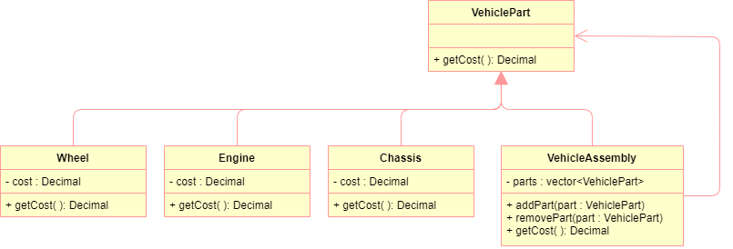

= Design Patterns

Examples of some of the most  common Gang of Four (Gof) Design Patterns

== Composite Pattern

The purpose of the composite pattern is to compose objects into tree structures 
to represent part-whole hierarchies. Composite lets clients treat individual 
objects and compositions of objects uniformly.

=== Class Diagram
